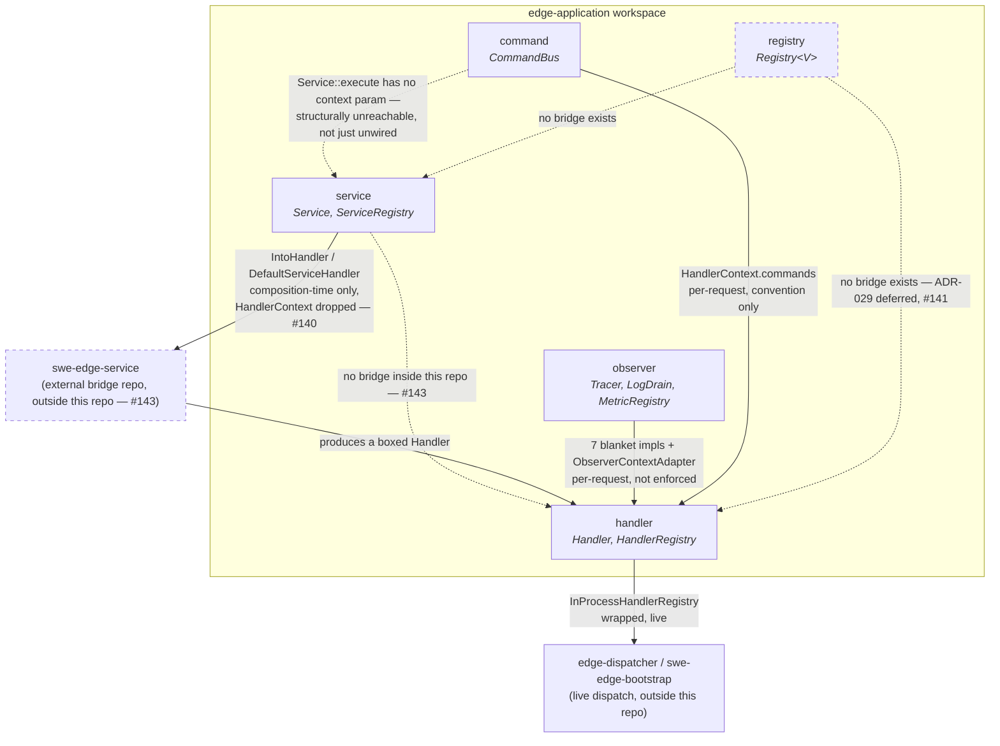

# edge-application Architecture

**Audience:** Developers and architects working in this repo, and any agent (human or AI)
picking up domain-crate work here.

This is the entry point for understanding how `edge-application`'s domain crates are structured
and how they connect — both to each other and to the wider `edge` platform. It synthesizes the
ADRs in `docs/adr/` and the verified dataflow in `docs/3-design/dataflow.md`; it does not
duplicate either, it points at them.

---

## What this repo is

`edge-application` is the domain/hexagon layer for the `edge` platform (per `edge`'s own
`docs/3-architecture/architecture.md`): a set of independent, SEA-compliant (`api/` → `core/` →
`saf/`) Rust crates, each declaring one port contract — `Handler`, `Service`, `Command`, `Query`,
`Event`, `Registry`, `Observer`, `Repository`, `Snapshot`, `Lifecycle`, `Policy`, `Validator`,
`Entity`, `Value Object`, `Saga`, `Projection` — plus an umbrella crate (`edge-domain`, package
`edge-application`) that re-exports whichever subset a consumer opts into via Cargo features.

Consumers outside this repo (`edge-proxy`, `edge-dispatcher`, `swe-edge-bootstrap`, `edge-llm-runtime`,
and others) depend on these crates as libraries and wire them into a live dispatch pipeline —
this repo itself contains no ingress/egress/transport code. See `docs/3-design/dataflow.md` for
exactly how far that wiring is confirmed to reach today.

**Important scoping note:** the list above is a claim *about* those repos, not something
`edge-application` can verify from its own side — this repo has zero Cargo-level dependency on
any of them, in either direction. Confirming that a named consumer actually wires a contract from
here into a live entrypoint requires independently inspecting *that* consumer's own repo; it is
never something `edge-application`'s own code, tests, or Cargo.toml establish. `edge-application`
(and any library built the same way, e.g. `swe-edge-service`) has no entrypoint of its own by
design — that is not a gap to close, it is what a library is. Don't conflate "a library's own
demonstrated consumption pattern, per its own example/tests" with "the entrypoint some downstream
application uses" — they are different claims requiring different evidence, and the second one is
always external to this repo.

---

## SEA layering

Every domain crate follows the same shape:

```
api/      — public contract: traits, dto/, vo/, errors/, entity/. No implementation.
core/     — concrete implementations. May depend on other domain crates' api/ (see
            no_foreign_type below for the exact rule).
saf/      — Service Abstraction Framework: the only public re-export surface. `_svc.rs` files
            (one `pub const X_SVC: &str` identity marker + `pub use crate::api::X` + optional
            factory) — a naming/discoverability convention, not a runtime lookup mechanism.
spi/      — extension points, where a crate has them.
```

**`no_foreign_type` (the rule most relevant to the ADRs below):** `api/` must never reference
another domain crate's concrete types in a type position. `core/` may — that's the layer where
cross-crate bridges live. This was the exact point ADR-004 got wrong before its 2026-07-15
amendment (see below) — it read `no_foreign_type` as "never import, anywhere," when the actual,
enforced rule is narrower and already satisfied by the real code.

---

## Governing ADRs

Every ADR in `docs/adr/` mirrors a governing decision made in the `edge` repo, scoped to what
this workspace owns. Status reflects this repo's own doc, not necessarily the upstream one's:

| ADR | Title | Status | Governs |
|---|---|---|---|
| [001](../adr/ADR-001-security-context-propagation.md) | Security Context Propagation | Accepted | `SecurityContext` shape referenced by `handler` |
| [002](../adr/ADR-002-event-sourcing-pipeline.md) | Event Sourcing Pipeline | Accepted | `event`, `EventStore`/`EventBus` |
| [003](../adr/ADR-003-repository-pattern.md) | Repository Pattern | Accepted | `repository` |
| [004](../adr/ADR-004-edge-service-bridge.md) | edge-service — Service-to-Handler Bridge | Accepted, amended 2026-07-15 | `service` ↔ `handler` bridge — see `dataflow.md` §2 |
| [005](../adr/ADR-005-command-query-bus-stack.md) | CommandBus/QueryBus Middleware Stack | Accepted | `command`, `query`, `HandlerContext.commands` |
| [006](../adr/ADR-006-observability-domain-primitive.md) | Observability Domain Primitive | Implemented | `observer`, `HandlerContext.observer` — see `dataflow.md` §3 |
| [043](../adr/ADR-043-llm-complete-domain-primitive.md) | LLM Complete Domain Primitive | Implemented | HTTP-level completion port (out of this repo's own domain-crate family; see note below) |
| [044](../adr/ADR-044-observability-llm-integration.md) | Observability↔LLM Integration | Implemented except L4 | Two injection seams between observability and LLM primitives |

**Note on ADR-043/044:** these reference LLM-domain concepts. Confirmed separately (2026-07-15,
exhaustive grep) that `edge-llm`'s own crates have zero Cargo-level dependency on
`edge-application` — these two ADRs record decisions made *about* LLM primitives that were
evaluated in this repo's planning process, not evidence of an actual code dependency in either
direction. Don't infer a live connection from their presence here.

**No ADR governs `registry`.** Its generalization intent (unifying `HandlerRegistry`/
`ServiceRegistry`) is recorded upstream in `edge`'s `ADR-029`, not mirrored locally — see
`dataflow.md` §5 and issue #141.

**[ADR-007](../adr/ADR-007-handler-associated-type-dispatch.md) is deliberately not in the table
above.** It lives in `docs/adr/` alongside these, but it is a locally originated design
clarification (`Handler`'s associated-type dispatch vs. Tower's/`edge-proxy`'s
generic-parameter dispatch) with no upstream `edge` decision behind it — including it in a table
whose own definition is "mirrors a governing decision made in the `edge` repo" would misstate what
kind of document it is.

---

## Confirmed dataflow



`docs/3-design/dataflow.md` is the traced, cited reference for how the pieces above actually
connect at the code level — the live `HandlerRegistry` chain, the `Service`→`Handler` bridge (now
external to this repo, in `swe-edge-service`, since `handler`'s own duplicate was removed —
#143) and its confirmed `HandlerContext`-dropping behavior, the `ObserverContext` blanket-impl
bridge, `CommandBus` injection, `registry::Registry<V>`'s confirmed lack of any bridge to
the other two registries, and — newest — `Command`/`CommandBus`'s confirmed lack of any path to
`Service`/`ServiceRegistry`, which is structurally impossible via the existing bridge rather than
merely unwired (dataflow.md §6). Read that document for citations; this document is the map, not
the evidence.

---

## Open design questions (not yet decided — tracked as issues, not ADRs)

These are real, current gaps identified while building the ADR/dataflow picture above. They are
deliberately **not** written as settled architecture — treat them as open until an ADR (or ADR
amendment) closes them:

- **[#139](https://github.com/sweengineeringlabs/edge-application/issues/139)** — `Handler`/`Service`'s
  `Request`/`Response` associated types are currently unconstrained (`Send + 'static` only).
  Proposes a shared `base` crate with `Request`/`Response` marker traits, bound at the
  trait level, so a `Handler`/`Service` implementor can't satisfy the contract with an arbitrary
  type. Explicitly scoped to stay an in-repo crate (see #141 below for why that matters).
- **[#140](https://github.com/sweengineeringlabs/edge-application/issues/140)** — `HandlerContext`
  (`security`, `commands`, `observer`) is silently dropped at the exact point a bridged `Service`
  is invoked (`DefaultServiceHandler::execute` forwards only `req.req`, never `req.ctx`; that type
  now lives in `swe-edge-service`, not this repo — see #143). Not necessarily a bug — `Service`'s
  trait never promised context — but currently undecided whether that's the intended final shape
  or should change. **Confirmed corollary (2026-07-17):** this same context-blind
  `Service::execute` shape is why `Command`/`CommandBus` has no path to `Service`/`ServiceRegistry`
  either — not merely unwired, but structurally impossible through the existing bridge, since
  there is no context parameter on `Service::execute` to carry a `CommandBus` reference through in
  the first place. See `dataflow.md` §6 for the full trace, the three-tier
  `Handler`/`Service`/`Command` context-access comparison, and the exhaustive grep evidence.
- **[#141](https://github.com/sweengineeringlabs/edge-application/issues/141)** — review of
  whether retiring `domain-security` in favor of the external `edge-security` repo (2026-07-06,
  `fba9004`) was the right call, given the `no_foreign_type` decoupling cost it produced five
  days later (`bd911de`). Relevant precedent for any future "should this concern live in its own
  repo" decision, including how #139's `base` crate should be scoped.
- **[#143](https://github.com/sweengineeringlabs/edge-application/issues/143)** — `handler`
  independently duplicated `edge-service`'s `Service`→`Handler` bridge (three implementations of
  the same on-ramp; `handler`'s two were removed 2026-07-17, consolidating on
  `edge-service`, the original, legitimately-built path). `edge-service` itself arched clean
  (234/236) and `handler` lost its `edge-application-service` dependency entirely,
  restoring ADR-004's Invariant I1. Remaining: bump `edge-service`'s pinned tag once this ships in
  a release. See ADR-004's 2026-07-17 amendment for the full trace, worked example, and
  resolution.

---

## See also

- `docs/3-design/dataflow.md` — the traced, cited dataflow reference this document summarizes
- `docs/3-design/handler-port-wiring.md` — how a `Handler` reaches a generic-per-type domain
  port (`Repository`, `EventStore`, `Saga`, `SnapshotStore`, `Projection`, `Policy`, `Registry`)
  via constructor injection + `Self::Request`, proven per-port in issue #149
- `docs/3-design/temp/edge-repo-dataflow-snapshot.md` — temporary mirror of `edge` repo's own
  (partially stale) dataflow docs; delete once that repo's git conflicts are resolved
- `docs/adr/` — this repo's own ADRs, each mirroring an upstream `edge` decision
- `edge`'s own `docs/3-architecture/architecture.md` and `docs/3-architecture/adr/` — the
  platform-wide picture this repo's domain layer fits into
