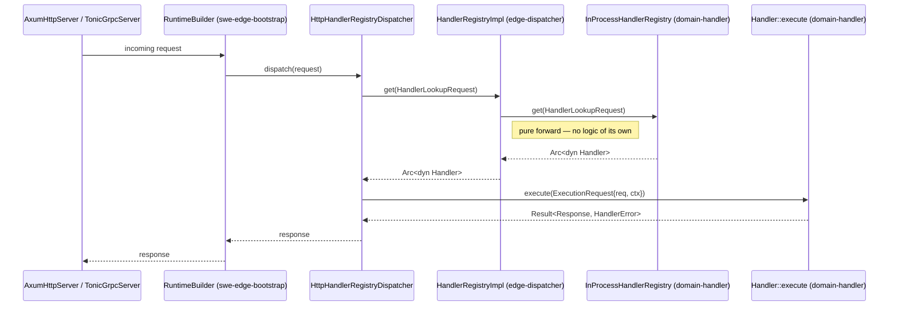
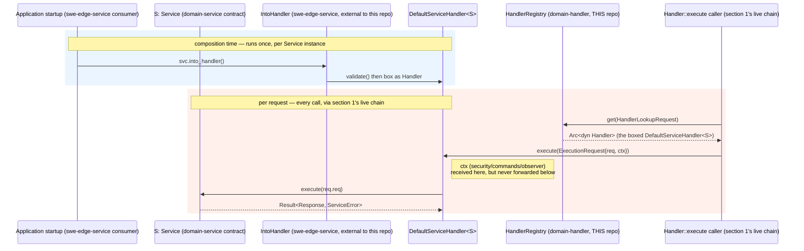

# edge-application Domain Component Dataflow

The reference for how this workspace's domain crates actually connect to each other and to
downstream consumers, as traced and confirmed on 2026-07-15. Every claim below is backed by a
specific file read directly, not inferred from naming or documentation — see the citations
inline. Where something is real but *not yet* connected, that is stated explicitly rather than
implied.

---

## 1. The confirmed-live dispatch chain

```
Handler-implementing request
        │
        ▼
edge_dispatch::HandlerRegistryImpl        (edge-dispatcher, package alias `edge_dispatch`)
        │  — every method is a one-line forward, no logic of its own
        ▼
edge_application_handler::InProcessHandlerRegistry     (domain-handler, THIS repo)
        │
        ▼
Handler::execute(ExecutionRequest { req, ctx })          (domain-handler's own trait)
```



**Proof:** `edge-dispatcher/scm/main/src/core/handler/handler_registry.rs` — `HandlerRegistryImpl<Request, Response>`
is `{ inner: InProcessHandlerRegistry<Request, Response> }`; `register`/`deregister`/`get`/`list_ids`/`len`
each forward directly to `self.inner`. This is the registry `swe-edge-bootstrap`'s
`RuntimeBuilder::http_route()`/`grpc_route()` actually constructs (`edge/scm/bootstrap/main/src/api/runtime/types/runtime_builder.rs`)
— the method wired to a live `AxumHttpServer`/gRPC server. So `domain-handler` sits at the root
of the one dispatch path confirmed to run in production, regardless of any other abstraction
layer's documented-vs-real status (see `temp/edge-repo-dataflow-snapshot.md` for the separate
`edge-proxy` `Job`/`Router` question, which is outside this repo).

`Handler::execute`'s signature in this repo is:

```rust
async fn execute(&self, req: ExecutionRequest<'_, Self::Request>) -> Result<Self::Response, HandlerError>;

pub struct ExecutionRequest<'a, Req> {
    pub req: Req,
    pub ctx: &'a HandlerContext<'a>,
}

pub struct HandlerContext<'a> {
    pub security: &'a SecurityContext,
    pub commands: &'a dyn CommandBus,
    pub observer: &'a dyn ObserverContext,
}
```

This is the **split** `edge-domain-handler` lineage's shape (bundled `req`+`ctx`, three-field
context) — distinct from an older, undocumented-as-current "monolithic" lineage that still
exists in some consumer examples (`edge/scm/bootstrap/examples/hello_edge.rs`). See the
amendment added to `edge`'s ADR-024 (`edge/docs/3-architecture/adr/ADR-024-handler-execute-contract.md`,
2026-07-15) for the full account — that ADR documents the monolithic two-parameter shape only.

---

## 2. `Service` → `Handler`: real bridge, but no longer inside this repo

**Amendment (2026-07-17, issue #143):** this section previously described `IntoHandler` and
`RegistryBridge`/`StdRegistryBridge` living in `domain-handler` (`main/src/core/handler/std_registry_bridge.rs`).
That was a second, independently-built, duplicate of a bridge that already existed in the
`swe-edge-service` repo — three implementations of the same on-ramp in total, once `domain-handler`'s
own two are counted. Both of `domain-handler`'s copies were removed 2026-07-17, and
`domain-handler` lost its `edge-application-service` dependency entirely (`domain-handler/Cargo.toml`,
confirmed by grep — no `edge-application-service` entry remains). **As of this amendment,
`domain-service::Service` and `domain-handler::Handler` have zero bridge between them anywhere in
this repo.** See ADR-004's 2026-07-17 amendment for the full trace and worked example.

The sole surviving bridge is external, in the `swe-edge-service` repo (package `swe-edge-service`,
crate root `service/main/src/`), which depends on this repo's `domain-handler`/`domain-service` as
a downstream consumer — the same relationship `edge-dispatcher`/`swe-edge-bootstrap` have to
`domain-handler` in section 1, not something this repo can see or verify from its own side (see
`architecture.md`'s scoping note). It is documented here only because the mechanism and its
consequences (next subsection) are directly relevant to understanding what a `Service` impl can
and cannot do once bridged — the same question this section always answered, just with the bridge
now correctly attributed to where it actually lives:

- **`IntoHandler`** (`swe-edge-service/service/main/src/core/bridge/service_handler.rs`) — a
  blanket impl for every `S: Service`, wrapping it in `DefaultServiceHandler<S>` whose
  `Handler::execute` delegates to the original `Service::execute`. Also now enforces
  `Validator::validate` at construction time (rejects a malformed `Service` before it is ever
  boxed into a `Handler`), rather than leaving validation as a separately-callable, easy-to-forget
  step — see that repo's `f3702f5` ("remove ServiceBridge/ServiceBackedHandler, enforce validation
  at construction").



**What this means precisely:** a `Service` impl has no path to ever be reached by a live request
in *this* repo's own dispatch chain (section 1) unless some external consumer bridges it — that
bridging is no longer something `domain-handler` offers internally. `domain-service` and
`domain-handler` are, within this repo, two fully independent port declarations with no
composition-time or per-request connection between them at all (see also section 6's related
`Command`↔`Service` finding, which follows from the same context-blind `Service::execute` shape
described next).

### `HandlerContext` does not survive the bridge

`Service::execute(&self, req: Self::Request) -> Result<Self::Response, ServiceError>` takes no
context parameter at all — `domain-service`'s trait is context-blind by design, in this repo,
independent of who bridges it. Wherever the bridge lives, it cannot compensate for this.
`DefaultServiceHandler<S>::execute` — the `Handler` impl the bridge produces — receives the full
`ExecutionRequest<'_, S::Request> { req, ctx: &HandlerContext }` like any other handler, but only
forwards `req.req` to the wrapped service:

```rust
// swe-edge-service/service/main/src/core/bridge/service_handler.rs
async fn execute(&self, req: ExecutionRequest<'_, S::Request>) -> Result<S::Response, HandlerError> {
    self.inner.execute(req.req).await.map_err(Self::convert_error)   // req.ctx is never read
}
```

So `req.ctx` — `security`, `commands`, and `observer` alike — is silently dropped at this exact
line. A `Service` reached through this bridge cannot see the caller's `SecurityContext`, cannot
dispatch further commands through `ctx.commands`, and cannot emit traces/metrics through
`ctx.observer`, even though the `Handler` wrapping it was constructed with all three. This is not
a bug in the narrow sense — `Service`'s trait signature never promised context — but it is a real
constraint on what a bridged `Service` can do that is easy to miss from the `Handler` side, where
context is normally always available. Anything a `Service` impl needs from context has to be
supplied another way (constructor injection, a field on the concrete type), not through this
bridge. See issue #140.

`edge-llm`'s own ADR-085 (`edge-llm/docs/3-design/adr/ADR-085-memory-ports-service-dispatch-reachability.md`)
documents this exact mechanism independently, from the consumer side, and explicitly names an
earlier investigation in that repo that first concluded `domain-service` was "an unused,
disconnected crate" before correcting itself against the real source — the same error this
document is written to avoid repeating.

---

## 3. `ObserverContext`: real bridge, not a stub

`domain-handler` depends directly on `domain-observer` (`edge-application-observer` in
`domain-handler/Cargo.toml`) and bridges it via seven blanket impls in
`domain-handler/main/src/core/handler/observability/into_handler_error.rs`:

```rust
impl<T: obs::Counter + ?Sized> Counter for T { ... }
impl<T: obs::Gauge + ?Sized> Gauge for T { ... }
impl<T: obs::Histogram + ?Sized> Histogram for T { ... }
impl<T: obs::Span + ?Sized> Span for T { ... }
impl<T: obs::LogDrain + ?Sized> LogDrain for T { ... }
impl<T: obs::HandlerTracer + ?Sized> HandlerTracer for T { ... }
impl<T: obs::ObserverContext + ?Sized> ObserverContext for T { ... }
```

Any real `domain-observer` implementor automatically satisfies domain-handler's locally-declared
mirror traits (same `no_foreign_type` pattern as section 2). `ObserverContextAdapter<'a, T: ?Sized>(pub &'a T)`
exists only to wrap an already-erased `&dyn ForeignTrait` reference so it, too, can satisfy the
local trait via the same blanket impl — it is not itself an observer context, just a bridge
newtype. `HandlerContext.observer` is populated with this bridged value and is reachable on
*every* `Handler::execute` call (section 1) — but nothing makes using it mandatory; a handler
author must explicitly call `ctx.observer` to get tracing/logging/metrics. There is no
enforcement layer requiring it, unlike `ctx.commands` for writes (section 4).

---

## 4. `CommandBus`: the enforced write path

`domain-handler` also depends directly on `domain-command`, bridged the same way section 3
bridges `domain-observer`: `HandlerContext.commands: &'a dyn CommandBus` is `domain-handler`'s own
locally-declared `CommandBus`/`Command`/`CommandDispatchRequest` mirror types
(`domain-handler/main/src/api/handler/traits/command_bus.rs`, `.../traits/command.rs`,
`.../dto/command_dispatch_request.rs`), never `edge_application_command`'s directly (SEA
`no_foreign_type`). Any real `edge_application_command::Command`/`CommandBus`/`DirectCommandBus`
implementor satisfies the local mirror automatically via a blanket impl in
`domain-handler/main/src/core/handler/command/into_handler_error.rs` — the same shape as section
3's `ObserverContext` bridge. Concretely: dispatching a command through `ctx.commands` from a
`Handler::execute` body means constructing `domain-handler`'s own `CommandDispatchRequest { command:
Box<dyn domain_handler::Command> }`, not `domain_command`'s type of the same name — the two are
distinct, non-interchangeable types with identical names, easy to reach for the wrong one (see
`examples/dataflow/src/main.rs`, which hit exactly this mismatch as a compile error while being
built).

`HandlerContext.commands` is present on every `execute()` call. Per the (amended) ADR-024: a write
handler is expected to dispatch mutations through `ctx.commands.dispatch(...)` rather than
mutating a repository directly — this is a documented convention (`ADR-024` §"Write handlers —
enforced path"), not a type-level guarantee; nothing prevents a `Handler` impl from ignoring
`ctx.commands` entirely.

---

## 5. What is *not* connected — `domain-registry::Registry<V>`

`domain-registry` declares a generalized resolution-registry trait:

```rust
pub trait Registry<V: ?Sized + Send + Sync>: Send + Sync {
    fn register(&self, ...) -> Result<RegisterResponse, RegistryError>;
    fn get(&self, ...) -> Result<RegistryLookupResponse<Self::Value>, RegistryError>;
    // ... same shape as HandlerRegistry/ServiceRegistry
}
```

This crate exists specifically to generalize `HandlerRegistry` and `ServiceRegistry` — confirmed
by `edge`'s ADR-029 (`edge/docs/3-architecture/adr/ADR-029-registry-lifecycle-primitives.md`):
*"Generalize the resolution-registry family (Handler/Service/future-Task)."* But per that same
ADR: *"`HandlerRegistry`/`ServiceRegistry` are left unchanged in this ADR — refactoring them onto
`Registry` ripples through two published sub-crates and every consumer's pin graph, so it is a
later coordinated sweep, not blocking work."*

**Confirmed by exhaustive grep** (2026-07-15, across `domain-registry`, `domain-handler`,
`domain-service`, `edge-domain`, and the entire `edge` monorepo): zero `impl From`/`Into`
conversions exist between `Registry<V>` and either `HandlerRegistry` or `ServiceRegistry`. The
only real consumer of `Registry<V>` today is the A2A plugin's task registry
(`edge/plugins/a2a`), unrelated to this repo's own `HandlerRegistry`/`ServiceRegistry`. Unlike
section 2's `Service`→`Handler` bridge, **no bridge exists for this unification** — that absence
is exactly why it remains disconnected. See the open tracking issue
[#139](https://github.com/sweengineeringlabs/edge-application/issues/139) for the related
(but distinct) `Request`/`Response` marker-trait tightening work, which touches the same two
crates (`domain-handler`, `domain-service`).

---

## 6. What is *not* connected — `Command`/`CommandBus` ↔ `Service`/`ServiceRegistry`

No mechanism connects a dispatched `Command` to invoking a named `Service` from a
`ServiceRegistry`. This is not merely unwired — it is **structurally impossible** through the
existing `Service`→`Handler` bridge (section 2), because `Service::execute()`'s signature has no
context parameter to carry a `CommandBus` reference through in the first place.

**Confirmed by exhaustive grep** (2026-07-17, both directions, across `domain-command`,
`domain-service`, and `swe-edge-service`): zero references from `domain-command`/`CommandBus` to
`Service`/`ServiceRegistry`, and zero references the other way. Neither crate's `Cargo.toml`
depends on the other (`domain-command/Cargo.toml`, `domain-service/Cargo.toml` — checked directly).

The reason isn't an oversight to fix — it falls out of a real, three-tier hierarchy of how much
execution context each of this repo's three request-handling ports actually receives:

| Port | `execute()` signature | Payload | Context available |
|---|---|---|---|
| `Handler` | `execute(&self, req: ExecutionRequest<'_, Req> { req, ctx: &HandlerContext })` | Yes | Yes — `security`, `commands: &dyn CommandBus`, `observer` (section 1) |
| `Service` | `execute(&self, req: Self::Request) -> Result<Self::Response, ServiceError>` | Yes | **None** — no context parameter exists at all (section 2) |
| `Command` | `execute(&self, _req: ExecutionRequest) -> Result<(), CommandError>` where `ExecutionRequest` is a zero-sized unit struct | **None** | **None** — carries neither payload nor context |

(`ExecutionRequest` here is `domain-command`'s own type,
`domain-command/main/src/api/command/dto/execution_request.rs` — `#[derive(...)] pub struct
ExecutionRequest;` — distinct from, and unrelated to, `domain-handler`'s
`ExecutionRequest<'a, Req>` used in the table's `Handler` row.)

Tracing why a `Command` dispatched from inside a `Handler::execute` call can never reach a named
`Service`, even when that `Service` has separately been bridged into the very same
`HandlerRegistry` the `Handler` is running in:

1. `Handler::execute` receives `ctx.commands: &dyn CommandBus` and may call
   `ctx.commands.dispatch(CommandDispatchRequest { command })` (`domain-command/main/src/api/command/traits/command_bus.rs`).
2. `CommandBus::dispatch` invokes `Command::execute(&self, _req: ExecutionRequest)` — but that
   `ExecutionRequest` is the zero-sized unit struct above, so the `Command` impl receives no
   payload and no context. It cannot look up or invoke a `Service` by name because it has nothing
   to look one up *with* — no `ServiceRegistry` reference, no `HandlerContext`, nothing.
3. Separately, even if a `Command` impl held a `ServiceRegistry` via constructor injection
   (the only way it could reach one at all, per step 2), and used it to fetch and bridge a
   `Service` into a `Handler` and call it — that inner `Service::execute(req)` call still has no
   context parameter (section 2's table row), so nothing round-trips back to the original
   `ctx.commands` the outer `Handler` started with. The two ports simply don't share a context
   shape that would let one meaningfully drive the other beyond one-way, hand-wired composition
   the type system doesn't help with.

So the gap is real at two independent levels: no existing code performs step 3's hypothetical
wiring (confirmed by the grep above), and even hand-written wiring following that path would still
lose context at the inner `Service::execute` boundary, for the same structural reason section 2
already documents for the `Handler`→`Service` direction. `Service::execute` lacking context isn't
a defect relative to some missing feature — it matches `domain-service`'s own documented purpose
as pure application-layer logic, not infrastructure-aware execution; `Command` carrying neither
payload nor context is the most minimal of the three contracts by the same logic. The three rows
above are a coherent, intentional design tier, not three independent oversights that happen to
look similar.

---

## Summary table

| Connection | Status | Mechanism | Proof |
|---|---|---|---|
| `HandlerRegistryImpl` (edge-dispatcher) → `domain-handler` | **Live, confirmed** | Direct struct wrapping, pure forwarding | `edge-dispatcher/.../handler_registry.rs` |
| `Service` (domain-service) → `Handler` (domain-handler) | **Not connected within this repo (as of #143); real bridge exists, but only externally in `swe-edge-service`; `HandlerContext` dropped at that bridge** | `IntoHandler` blanket impl, `DefaultServiceHandler` | `swe-edge-service/service/main/src/core/bridge/service_handler.rs` |
| `domain-observer` → `domain-handler` | **Real, per-request-reachable, not enforced** | 7 blanket impls + `ObserverContextAdapter` | `domain-handler/.../into_handler_error.rs` |
| `domain-command` → `domain-handler` | **Real, per-request-reachable, convention-only** | `HandlerContext.commands` field | ADR-024 |
| `domain-registry::Registry<V>` → `HandlerRegistry`/`ServiceRegistry` | **Not connected** | None — deferred by ADR-029 | grep, exhaustive, zero matches |
| `Command`/`CommandBus` → `Service`/`ServiceRegistry` | **Not connected — structurally impossible via existing bridge, not just unwired** | None — `Service::execute` has no context parameter to carry a `CommandBus` through | grep, exhaustive, zero matches, both directions |

---

## See also

- `examples/dataflow/src/main.rs` (`cargo run -p edge-application-dataflow-example`) — a runnable
  reproduction of sections 2 and 6's findings: traces, at the code level, exactly where
  `HandlerContext` does (`Handler` -> `Command`, via `ctx.commands.dispatch`) and does not
  (`Handler` -> `Service`) reach. Not a production bridge — `DemoServiceHandler` in that file
  exists only to make the finding observable; the real bridge lives in `swe-edge-service`.
- `docs/3-design/temp/edge-repo-dataflow-snapshot.md` — the `edge` repo's own (partially stale)
  ingress/egress dataflow docs, temporarily mirrored here; delete once that repo's git conflicts
  are resolved and its docs are fixed in place.
- [Issue #139](https://github.com/sweengineeringlabs/edge-application/issues/139) — proposed
  `domain-base` shared crate for `Request`/`Response` marker traits, touching the same
  `domain-handler`/`domain-service` boundary as section 2 above.
- [Issue #140](https://github.com/sweengineeringlabs/edge-application/issues/140) — `HandlerContext`
  dropped at the `Service`→`Handler` bridge; the same context-blind `Service::execute` shape is
  the root cause of section 6's `Command`↔`Service` finding.
- [Issue #143](https://github.com/sweengineeringlabs/edge-application/issues/143) — removal of
  `domain-handler`'s duplicate `Service`→`Handler` bridge, resolved 2026-07-17; see ADR-004's
  amendment and section 2 above for the corrected picture.
- `edge`'s ADR-024 (amended 2026-07-15), ADR-020, ADR-029 — the governing ADRs for sections 1, 2,
  and 5 respectively.
- `edge-llm`'s ADR-085 — independent confirmation of section 2 from the consumer side.
