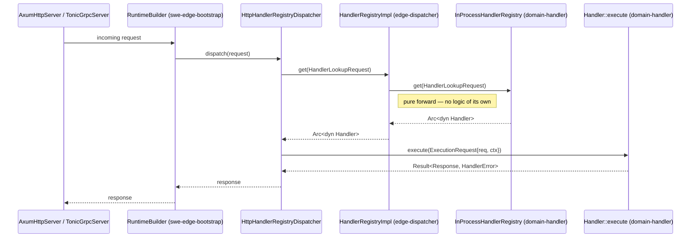
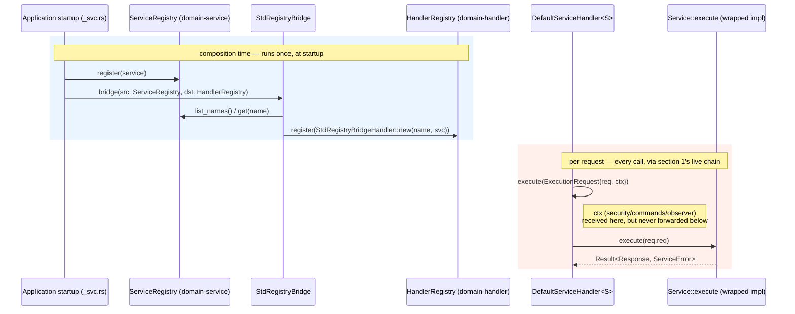

# edge-application Domain Component Dataflow

The reference for how this workspace's domain crates actually connect to each other and to
downstream consumers, as traced and confirmed on 2026-07-15. Every claim below is backed by a
specific file read directly, not inferred from naming or documentation — see the citations
inline. Where something is real but *not yet* connected, that is stated explicitly rather than
implied.

---

## 1. The confirmed-live dispatch chain

```
Handler-implementing request
        │
        ▼
edge_dispatch::HandlerRegistryImpl        (edge-dispatcher, package alias `edge_dispatch`)
        │  — every method is a one-line forward, no logic of its own
        ▼
edge_application_handler::InProcessHandlerRegistry     (domain-handler, THIS repo)
        │
        ▼
Handler::execute(ExecutionRequest { req, ctx })          (domain-handler's own trait)
```



**Proof:** `edge-dispatcher/scm/main/src/core/handler/handler_registry.rs` — `HandlerRegistryImpl<Request, Response>`
is `{ inner: InProcessHandlerRegistry<Request, Response> }`; `register`/`deregister`/`get`/`list_ids`/`len`
each forward directly to `self.inner`. This is the registry `swe-edge-bootstrap`'s
`RuntimeBuilder::http_route()`/`grpc_route()` actually constructs (`edge/scm/bootstrap/main/src/api/runtime/types/runtime_builder.rs`)
— the method wired to a live `AxumHttpServer`/gRPC server. So `domain-handler` sits at the root
of the one dispatch path confirmed to run in production, regardless of any other abstraction
layer's documented-vs-real status (see `temp/edge-repo-dataflow-snapshot.md` for the separate
`edge-proxy` `Job`/`Router` question, which is outside this repo).

`Handler::execute`'s signature in this repo is:

```rust
async fn execute(&self, req: ExecutionRequest<'_, Self::Request>) -> Result<Self::Response, HandlerError>;

pub struct ExecutionRequest<'a, Req> {
    pub req: Req,
    pub ctx: &'a HandlerContext<'a>,
}

pub struct HandlerContext<'a> {
    pub security: &'a SecurityContext,
    pub commands: &'a dyn CommandBus,
    pub observer: &'a dyn ObserverContext,
}
```

This is the **split** `edge-domain-handler` lineage's shape (bundled `req`+`ctx`, three-field
context) — distinct from an older, undocumented-as-current "monolithic" lineage that still
exists in some consumer examples (`edge/scm/bootstrap/examples/hello_edge.rs`). See the
amendment added to `edge`'s ADR-024 (`edge/docs/3-architecture/adr/ADR-024-handler-execute-contract.md`,
2026-07-15) for the full account — that ADR documents the monolithic two-parameter shape only.

---

## 2. `Service` → `Handler`: real, tested, load-bearing — but composition-time, not per-request

`domain-service::Service` (`name()` + `execute(req) -> Result<Resp, ServiceError>`) and
`domain-handler::Handler` are declared independently — neither's `api/` references the other's
types directly (SEA `no_foreign_type`). They are bridged by:

- **`IntoHandler`** (`domain-handler/main/src/api/handler/traits/into_handler.rs`) — a blanket
  impl for every `S: Service`, wrapping it in `DefaultServiceHandler<S>` whose `Handler::execute`
  delegates to the original `Service::execute`.
- **`RegistryBridge`/`StdRegistryBridge`** (`domain-handler/main/src/core/handler/std_registry_bridge.rs`)
  — bulk-transfers every entry of a `ServiceRegistry` into a `HandlerRegistry`:

  ```rust
  impl RegistryBridge for StdRegistryBridge {
      fn bridge<Req, Resp>(&self, req: BridgeRequest<'_, Req, Resp>) -> Result<BridgeResponse, HandlerError> {
          let names = req.src.list_names(ListNamesRequest)?.names;   // req.src: ServiceRegistry
          for name in names {
              if let Some(svc) = req.src.get(ServiceLookupRequest{name})?.service {
                  req.dst.register(RegisterHandlerRequest::new(Arc::new(
                      StdRegistryBridgeHandler::new(name, svc),
                  )))?;                                              // req.dst: HandlerRegistry
              }
          }
          Ok(BridgeResponse { transferred: count })
      }
  }
  ```



**What this means precisely:** `ServiceRegistry` is not part of the per-request dispatch path —
a live request never touches it. It is real, load-bearing infrastructure at **composition time**:
an application populates a `ServiceRegistry` with its `Service` impls once, at startup, then runs
`StdRegistryBridge::bridge()` (or a single `svc.into_handler()`) to produce the `HandlerRegistry`
that section 1's live dispatch chain actually uses. Without this bridge, a `Service` impl has no
path to ever be reached by a live request — this is the entire reason `Service` has production
relevance at all (see `docs/3-design/temp/edge-repo-dataflow-snapshot.md` discussion for the
general principle).

### `HandlerContext` does not survive the bridge

`Service::execute(&self, req: Self::Request) -> Result<Self::Response, ServiceError>` takes no
context parameter at all — `domain-service`'s trait is context-blind by design. The bridge does
not compensate for this. `DefaultServiceHandler<S>::execute` — the `Handler` impl the bridge
produces — receives the full `ExecutionRequest<'_, S::Request> { req, ctx: &HandlerContext }`
like any other handler, but only forwards `req.req` to the wrapped service:

```rust
// domain-handler/main/src/core/handler/service/service_handler.rs
async fn execute(&self, req: ExecutionRequest<'_, S::Request>) -> Result<S::Response, HandlerError> {
    self.inner.execute(req.req).await.map_err(HandlerError::from)   // req.ctx is never read
}
```

So `req.ctx` — `security`, `commands`, and `observer` alike — is silently dropped at this exact
line. A `Service` reached through this bridge cannot see the caller's `SecurityContext`, cannot
dispatch further commands through `ctx.commands`, and cannot emit traces/metrics through
`ctx.observer`, even though the `Handler` wrapping it was constructed with all three. This is not
a bug in the narrow sense — `Service`'s trait signature never promised context — but it is a real
constraint on what a bridged `Service` can do that is easy to miss from the `Handler` side, where
context is normally always available. Anything a `Service` impl needs from context has to be
supplied another way (constructor injection, a field on the concrete type), not through this
bridge.

`edge-llm`'s own ADR-085 (`edge-llm/docs/3-design/adr/ADR-085-memory-ports-service-dispatch-reachability.md`)
documents this exact mechanism independently, from the consumer side, and explicitly names an
earlier investigation in that repo that first concluded `domain-service` was "an unused,
disconnected crate" before correcting itself against the real source — the same error this
document is written to avoid repeating.

---

## 3. `ObserverContext`: real bridge, not a stub

`domain-handler` depends directly on `domain-observer` (`edge-application-observer` in
`domain-handler/Cargo.toml`) and bridges it via seven blanket impls in
`domain-handler/main/src/core/handler/observability/into_handler_error.rs`:

```rust
impl<T: obs::Counter + ?Sized> Counter for T { ... }
impl<T: obs::Gauge + ?Sized> Gauge for T { ... }
impl<T: obs::Histogram + ?Sized> Histogram for T { ... }
impl<T: obs::Span + ?Sized> Span for T { ... }
impl<T: obs::LogDrain + ?Sized> LogDrain for T { ... }
impl<T: obs::HandlerTracer + ?Sized> HandlerTracer for T { ... }
impl<T: obs::ObserverContext + ?Sized> ObserverContext for T { ... }
```

Any real `domain-observer` implementor automatically satisfies domain-handler's locally-declared
mirror traits (same `no_foreign_type` pattern as section 2). `ObserverContextAdapter<'a, T: ?Sized>(pub &'a T)`
exists only to wrap an already-erased `&dyn ForeignTrait` reference so it, too, can satisfy the
local trait via the same blanket impl — it is not itself an observer context, just a bridge
newtype. `HandlerContext.observer` is populated with this bridged value and is reachable on
*every* `Handler::execute` call (section 1) — but nothing makes using it mandatory; a handler
author must explicitly call `ctx.observer` to get tracing/logging/metrics. There is no
enforcement layer requiring it, unlike `ctx.commands` for writes (section 4).

---

## 4. `CommandBus`: the enforced write path

`domain-handler` also depends directly on `domain-command`. `HandlerContext.commands: &'a dyn CommandBus`
is present on every `execute()` call. Per the (amended) ADR-024: a write handler is expected to
dispatch mutations through `ctx.commands.dispatch(...)` rather than mutating a repository
directly — this is a documented convention (`ADR-024` §"Write handlers — enforced path"), not a
type-level guarantee; nothing prevents a `Handler` impl from ignoring `ctx.commands` entirely.

---

## 5. What is *not* connected — `domain-registry::Registry<V>`

`domain-registry` declares a generalized resolution-registry trait:

```rust
pub trait Registry<V: ?Sized + Send + Sync>: Send + Sync {
    fn register(&self, ...) -> Result<RegisterResponse, RegistryError>;
    fn get(&self, ...) -> Result<RegistryLookupResponse<Self::Value>, RegistryError>;
    // ... same shape as HandlerRegistry/ServiceRegistry
}
```

This crate exists specifically to generalize `HandlerRegistry` and `ServiceRegistry` — confirmed
by `edge`'s ADR-029 (`edge/docs/3-architecture/adr/ADR-029-registry-lifecycle-primitives.md`):
*"Generalize the resolution-registry family (Handler/Service/future-Task)."* But per that same
ADR: *"`HandlerRegistry`/`ServiceRegistry` are left unchanged in this ADR — refactoring them onto
`Registry` ripples through two published sub-crates and every consumer's pin graph, so it is a
later coordinated sweep, not blocking work."*

**Confirmed by exhaustive grep** (2026-07-15, across `domain-registry`, `domain-handler`,
`domain-service`, `edge-domain`, and the entire `edge` monorepo): zero `impl From`/`Into`
conversions exist between `Registry<V>` and either `HandlerRegistry` or `ServiceRegistry`. The
only real consumer of `Registry<V>` today is the A2A plugin's task registry
(`edge/plugins/a2a`), unrelated to this repo's own `HandlerRegistry`/`ServiceRegistry`. Unlike
section 2's `Service`→`Handler` bridge, **no bridge exists for this unification** — that absence
is exactly why it remains disconnected. See the open tracking issue
[#139](https://github.com/sweengineeringlabs/edge-application/issues/139) for the related
(but distinct) `Request`/`Response` marker-trait tightening work, which touches the same two
crates (`domain-handler`, `domain-service`).

---

## Summary table

| Connection | Status | Mechanism | Proof |
|---|---|---|---|
| `HandlerRegistryImpl` (edge-dispatcher) → `domain-handler` | **Live, confirmed** | Direct struct wrapping, pure forwarding | `edge-dispatcher/.../handler_registry.rs` |
| `ServiceRegistry` (domain-service) → `HandlerRegistry` (domain-handler) | **Real, composition-time only; `HandlerContext` dropped at the bridge** | `IntoHandler` blanket impl, `RegistryBridge`/`StdRegistryBridge` | `domain-handler/.../std_registry_bridge.rs`, `.../into_handler.rs`, `.../service/service_handler.rs` |
| `domain-observer` → `domain-handler` | **Real, per-request-reachable, not enforced** | 7 blanket impls + `ObserverContextAdapter` | `domain-handler/.../into_handler_error.rs` |
| `domain-command` → `domain-handler` | **Real, per-request-reachable, convention-only** | `HandlerContext.commands` field | ADR-024 |
| `domain-registry::Registry<V>` → `HandlerRegistry`/`ServiceRegistry` | **Not connected** | None — deferred by ADR-029 | grep, exhaustive, zero matches |

---

## See also

- `docs/3-design/temp/edge-repo-dataflow-snapshot.md` — the `edge` repo's own (partially stale)
  ingress/egress dataflow docs, temporarily mirrored here; delete once that repo's git conflicts
  are resolved and its docs are fixed in place.
- [Issue #139](https://github.com/sweengineeringlabs/edge-application/issues/139) — proposed
  `domain-base` shared crate for `Request`/`Response` marker traits, touching the same
  `domain-handler`/`domain-service` boundary as section 2 above.
- `edge`'s ADR-024 (amended 2026-07-15), ADR-020, ADR-029 — the governing ADRs for sections 1, 2,
  and 5 respectively.
- `edge-llm`'s ADR-085 — independent confirmation of section 2 from the consumer side.
