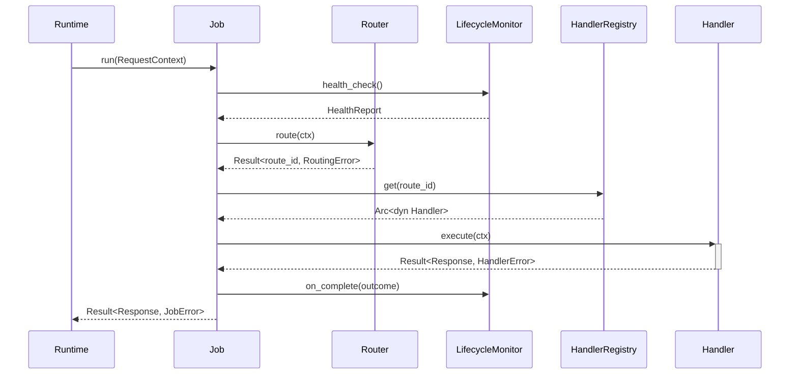

# TEMP: Dataflow snapshot copied from the `edge` repo

**Why this file exists here:** copied from `sweengineeringlabs/edge` (`docs/3-architecture/architecture.md`
and `proxy/scm/docs/architecture.md`) on 2026-07-15, during an investigation of how
`edge-application`'s domain crates (`domain-handler`, `domain-service`, `domain-registry`,
`domain-observer`, `domain-command`) connect to the rest of the platform. The source repo
(`edge`) currently has unresolved `git stash pop` conflicts in its working tree (`scm/Cargo.toml`,
`docs/3-architecture/architecture.md` itself) that block any commit there — see two pending
stashes on its `dev` branch. This snapshot preserves the relevant content here until that repo
is unblocked and the real doc can be corrected/committed in place.

**Do not treat this as canonical edge-application documentation.** It documents `edge`-repo
concepts (`Job`, `Router`, `LifecycleMonitor`, `HttpInbound`/`GrpcInbound`, `edge-proxy`) that
live outside this repo. Delete this file once `edge`'s own docs are fixed and committed —
it is a working reference, not a permanent artifact.

---

## Source 1: `edge/docs/3-architecture/architecture.md` — Dataflow Diagram

```mermaid
graph LR
    C["Client"] -->|"HTTP/gRPC request"| T

    subgraph ingress_layer["Ingress Layer"]
        T["AxumHttpServer\nTonicGrpcServer"]
        T -->|"HttpRequest\nGrpcRequest"| H["HttpInbound.handle()\nGrpcInbound.handle()"]
    end

    subgraph domain_layer["Domain Layer"]
        H -->|"job dispatch"| R["Router"]
        R -->|"handler id"| HR["HandlerRegistry"]
        HR -->|"execute"| BL["Business Logic\n(Handler impl)"]
    end

    subgraph egress_layer["Egress Layer"]
        BL -->|"HttpRequest"| HO["DefaultHttpOutbound"]
        HO -->|"auth→retry→rate\nbreaker→cache"| reqwest["reqwest-middleware"]
        reqwest -->|"HTTPS / h2c"| US["Upstream Service"]
        US -->|"HTTP Response"| reqwest
        reqwest -->|"HttpResponse"| HO
        HO -->|"HttpResponse"| BL
    end

    BL -->|"HttpResponse\nGrpcResponse"| H
    H -->|"response"| T
    T -->|"HTTP/gRPC response"| C
```



### This repo's own accuracy note (2026-07-04, already present in the source doc)

> This generic `Router`/`dispatch(job)` sequence (and the matching `Job → Router →
> LifecycleMonitor → HandlerRegistry → Handler` sequence documented in
> `proxy/scm/docs/architecture.md`, reproduced below) does not reflect what the real production
> HTTP ingress dispatcher does today. `transport/ingress/http`'s
> `HttpHandlerRegistryDispatcher::handle()` has **no dependency on `edge-proxy` at all** — it
> does its own inline path-matcher route lookup (`self.router.at(&path)`, a `matchit`-based
> router unrelated to the abstract `Router` trait shown here) directly against a
> `HandlerRegistry::get()`, and its own inline `health_check()` — no `LifecycleMonitor` type is
> involved. Whether the abstract `Job`/`Router`/`LifecycleMonitor`/`edge-proxy` layer is used by
> some other, not-yet-identified call path, or is purely aspirational, was not resolved as of
> that note — treat this diagram as the intended design, not confirmed current behavior for HTTP.

---

## Source 2: `edge/proxy/scm/docs/architecture.md` — `edge-proxy`'s own `Job` sequence

This is accurate **for `edge-proxy`'s own `Job` type** — confirmed by reading `edge-proxy`'s own
`examples/dispatch.rs`, which faithfully demonstrates every participant below (`Job::run`,
`Router::route`, `HandlerRegistry::get`, `Handler::execute`, `ProxySvc::new_null_lifecycle_monitor()`).
What is *not* confirmed is whether anything in the live, running system actually calls
`Job::run()` — see the 2026-07-15 finding below.



---

## 2026-07-15 finding, not yet folded into either source doc

Traced directly against `edge/scm/bootstrap/main/src/api/runtime/types/runtime_builder.rs`
(`swe-edge-bootstrap`'s `RuntimeBuilder::http_route()`/`grpc_route()` — the method that is
actually wired to a running `AxumHttpServer`/gRPC server in real deployments):

```rust
use edge_dispatch::{Handler, HandlerRegistry, HandlerRegistryImpl};

pub fn http_route<Req, Resp>(self, handler: Arc<dyn Handler<Request=Req, Response=Resp>>) -> Self {
    let d = self.http_dispatcher.get_or_insert_with(|| {
        HttpHandlerRegistryDispatcher::new(Arc::new(HandlerRegistryImpl::new()))
    });
    ...
}
```

This constructs `HttpHandlerRegistryDispatcher` directly around `edge_dispatch::HandlerRegistryImpl`
(`edge_dispatch` is a Cargo alias for the real `edge-dispatcher` package — confirmed in
`edge/scm/Cargo.toml`'s `[workspace.dependencies]`). **No `Job`, no `Router`, no `edge-proxy`
type appears anywhere in this path.** So there are two structurally separate, parallel dispatch
shapes coexisting in this ecosystem:

1. **`edge-proxy`'s `Job`/`Router`/`LifecycleMonitor` abstraction** — accurately documented,
   accurately demonstrated in `edge-proxy`'s own example, but not confirmed to be part of any
   live request path.
2. **`swe-edge-bootstrap`'s `http_route()` → `edge_dispatch::HandlerRegistryImpl` path** — what
   is actually wired to a live server today, bypassing `Job`/`Router`/`edge-proxy` entirely.

And critically for `edge-application`: `edge_dispatch::HandlerRegistryImpl` (path 2, the live
one) is itself a thin wrapper around `edge_application_handler::InProcessHandlerRegistry` —
confirmed by reading `edge-dispatcher/scm/main/src/core/handler/handler_registry.rs`, where
every method (`register`/`deregister`/`get`/`list_ids`/`len`) is a one-line forward to
`self.inner: InProcessHandlerRegistry`. So `domain-handler` (this repo's own crate) sits at the
root of the one dispatch path that is actually confirmed live, regardless of which docs above
are accurate.
