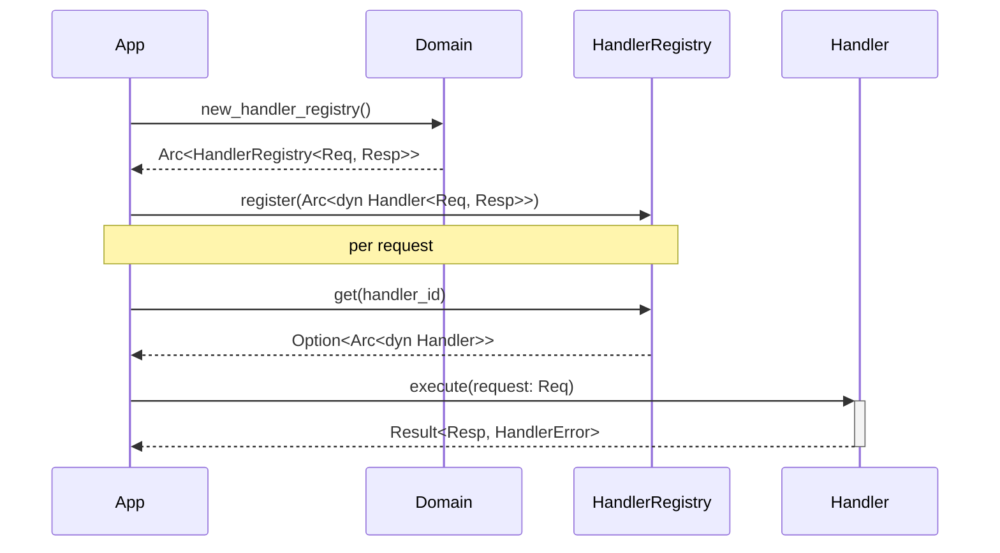
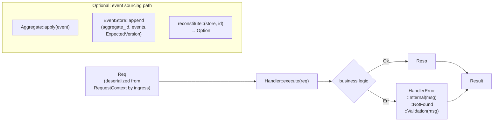

# Domain Architecture

## Core Principle: Abstraction as a Contract

**The consumer doesn't know or care what's behind the contract.**

Every trait in this crate is a **contract layer**. Callers depend on the trait interface, not the implementation. This achieves:

1. **Provider independence** — Swap implementations without changing business logic
2. **Testability** — Inject noop or in-memory implementations in tests
3. **Transparency** — Callers see only the contract, never the backend

### Examples

| Contract | What the caller sees | What happens behind it |
|----------|---------------------|------------------------|
| `EventStore<E>` | `.append()`, `.load()` | In-mem RwLock, Postgres, Kafka, DynamoDB — doesn't matter |
| `Repository<T, Id>` | `.save()`, `.find()`, `.list()` | HashMap, SQLite, MongoDB — caller is blind |
| `CommandBus` | `.dispatch(cmd)` | Inline, async queue, message broker — abstracted |
| `Handler<Req, Res>` | `.execute(req)` | Echo handler, LLM handler, database handler — handler code is portable |
| `ObserveContext` (from `edge-domain-observer`) | `.tracer()`, `.metrics()`, `.drain()` | Noop (tests), OpenTelemetry, Prometheus — observer backend is pluggable |

**This is why business logic code is transport-agnostic, persistence-agnostic, and observability-agnostic.** The domain layer defines what it needs; infrastructure layers satisfy those contracts.

---

## Workspace overview

The domain workspace is a single Rust crate — `edge-domain` — that provides provider-agnostic
business logic contracts. It owns the Handler dispatch model, CQRS buses, repository abstractions,
and event sourcing primitives. No transport type (Axum, Tonic, reqwest) appears anywhere in this crate.

| Crate | Package | Purpose |
|-------|---------|---------|
| `domain` | `edge-domain` | Business logic contracts — Handler, Repository, EventStore, CQRS buses |

---

## SEA module layout

```
src/
├── api/
│   ├── handler/
│   │   ├── handler.rs              # Handler<Req, Res> trait — single dispatch unit
│   │   ├── handler_registry.rs     # HandlerRegistry<Req, Res> — pattern-keyed handler map
│   │   ├── echo_handler.rs         # EchoHandler — returns input unchanged (test helper)
│   │   └── request/                # RequestContext, RequestContextBuilder
│   ├── event/
│   │   ├── aggregate.rs            # Aggregate trait — apply() + id()
│   │   ├── domain_event.rs         # DomainEvent trait — event_type, aggregate_id, occurred_at
│   │   ├── event_store.rs          # EventStore<E> trait — append / load / load_from
│   │   ├── event_envelope.rs       # EventEnvelope<E> — wraps event with sequence + timestamp
│   │   ├── event_store_error.rs    # EventStoreError — ConcurrencyConflict, NotFound, Internal
│   │   ├── expected_version.rs     # ExpectedVersion — Any | NoStream | Exact(u64)
│   │   ├── event_publisher.rs      # EventPublisher trait — publish()
│   │   └── noop_event_publisher.rs # NoopEventPublisher — discards events (dev/test)
│   ├── repository/
│   │   ├── repository.rs           # Repository<T, Id> trait — save / find / delete / list
│   │   └── in_memory_repository.rs # InMemoryRepository — test/dev default
│   ├── command/
│   │   ├── command.rs              # Command trait
│   │   ├── command_bus.rs          # CommandBus trait — dispatch()
│   │   ├── command_error.rs        # CommandError
│   │   └── direct_command_bus.rs   # DirectCommandBus — inline dispatch
│   ├── query/
│   │   ├── query.rs                # Query trait
│   │   ├── query_bus.rs            # QueryBus<R> trait — execute()
│   │   ├── query_error.rs          # QueryError
│   │   └── direct_query_bus.rs     # DirectQueryBus — inline dispatch
│   ├── service/
│   │   ├── service.rs              # Service<Req, Res> trait
│   │   ├── service_registry.rs     # ServiceRegistry<Req, Res>
│   │   └── service_error.rs        # ServiceError
│   ├── queryable_repository.rs     # QueryableRepository<T, Id> — find_by / count_by / find_one_by
│   ├── outbound_registry.rs        # OutboundRegistry — keyed outbound port map
│   ├── handler_error.rs            # HandlerError — standard handler failure type
│   ├── repository_error.rs         # RepositoryError
│   ├── spec.rs                     # Spec<T> trait — predicate for queryable queries
│   ├── traits.rs                   # Validator trait
│   └── mod.rs
├── core/
│   ├── event/
│   │   ├── in_memory_event_store.rs  # InMemoryEventStore — parking_lot::RwLock, optimistic concurrency
│   │   └── noop_event_publisher.rs
│   ├── repository/
│   │   └── in_memory_repository.rs   # InMemoryRepository
│   ├── command/
│   │   └── direct_command_bus.rs
│   └── query/
│       └── direct_query_bus.rs
├── saf/
│   └── edge_domain_svc.rs          # All public factory functions
└── lib.rs                          # pub use saf::*
```

---

## Key contracts

### Handler dispatch

```rust
pub trait Handler<Request, Response>: Send + Sync {
    fn id(&self)      -> &str;
    fn pattern(&self) -> &str;
    fn execute(&self, request: Request) -> BoxFuture<'_, Result<Response, HandlerError>>;
}
```

Handlers are registered by pattern in a `HandlerRegistry`. The proxy layer resolves an inbound
request to a handler ID and calls `execute`.

---

### Event sourcing

```rust
pub trait Aggregate: Default + Send + Sync {
    type Event: DomainEvent;
    fn apply(&mut self, event: &Self::Event);
    fn id(&self) -> &str;
}

pub trait EventStore<E>: Send + Sync
where E: DomainEvent + Send + 'static {
    fn append(&self, aggregate_id: &str, events: Vec<E>, expected: ExpectedVersion)
        -> BoxFuture<'_, Result<u64, EventStoreError>>;
    fn load(&self, aggregate_id: &str)
        -> BoxFuture<'_, Result<Vec<EventEnvelope<E>>, EventStoreError>>;
    fn load_from(&self, aggregate_id: &str, from_sequence: u64)
        -> BoxFuture<'_, Result<Vec<EventEnvelope<E>>, EventStoreError>>;
}
```

`ExpectedVersion` enforces optimistic concurrency:

| Variant | Behaviour |
|---------|-----------|
| `Any` | Append unconditionally |
| `NoStream` | Fail if any events already exist for this aggregate ID |
| `Exact(n)` | Fail if the current stream version differs from `n` |

---

### Repository

```rust
pub trait Repository<T, Id>: Send + Sync {
    fn save(&self, id: Id, entity: T) -> BoxFuture<'_, Result<(), RepositoryError>>;
    fn find(&self, id: &Id)           -> BoxFuture<'_, Result<Option<T>, RepositoryError>>;
    fn delete(&self, id: &Id)         -> BoxFuture<'_, Result<(), RepositoryError>>;
    fn list(&self)                    -> BoxFuture<'_, Result<Vec<T>, RepositoryError>>;
}
```

`QueryableRepository<T, Id>` extends `Repository` with specification-based queries:

```rust
fn find_by(&self, spec: &dyn Spec<T>)     -> BoxFuture<'_, Result<Vec<T>, RepositoryError>>;
fn find_one_by(&self, spec: &dyn Spec<T>) -> BoxFuture<'_, Result<Option<T>, RepositoryError>>;
fn count_by(&self, spec: &dyn Spec<T>)    -> BoxFuture<'_, Result<usize, RepositoryError>>;
```

---

### Observability (edge-domain-observer)

**From the handler's perspective, this IS the observer.** Handlers don't know or care what's behind it.

```rust
pub trait ObserveContext: Send + Sync {
    fn tracer(&self) -> &dyn HandlerTracer;   // Distributed tracing (Jaeger? Datadog? Noop?)
    fn drain(&self) -> &dyn LogDrain;         // Structured logs (ELK? Loki? /dev/null?)
    fn metrics(&self) -> &dyn MetricRegistry; // Metrics (Prometheus? Grafana? Silent?)
}
```

**HandlerContext injects the observer at request time:**

```rust
pub struct HandlerContext<'a> {
    pub security: &'a SecurityContext,
    pub commands: &'a dyn CommandBus,
    pub observer: &'a dyn ObserveContext,  // ← Observability seam
}
```

**In tests:** Use `StdObserveFactory::noop_observe_context()` — handlers observe, but nothing happens.  
**In production:** Wire OpenTelemetry, Prometheus, Datadog, or any backend to the same interface.

The handler code **never changes**. It just calls `ctx.observer().tracer().start_span(...)` and trust the abstraction.

---

## SAF — public factory surface

| Factory | Returns | Notes |
|---------|---------|-------|
| `echo_handler::<T>(id, pattern)` | `Arc<dyn Handler<T, T>>` | Echoes input — for transport tests |
| `new_handler_registry::<Req, Res>()` | `Arc<HandlerRegistry<Req, Res>>` | Empty, thread-safe |
| `new_service_registry::<Req, Res>()` | `Arc<ServiceRegistry<Req, Res>>` | Empty, thread-safe |
| `new_in_memory_repository::<T, Id>()` | `Arc<dyn Repository<T, Id>>` | Dev/test only |
| `new_in_memory_queryable_repository::<T, Id>()` | `Arc<dyn QueryableRepository<T, Id>>` | Dev/test; supports `Spec` queries |
| `new_in_memory_event_store::<E>()` | `Arc<dyn EventStore<E>>` | Dev/test; optimistic concurrency |
| `reconstitute::<A>(store, aggregate_id)` | `Result<Option<A>, EventStoreError>` | Replays event stream into aggregate |
| `direct_command_bus()` | `Arc<dyn CommandBus>` | Inline dispatch |
| `direct_query_bus::<R>()` | `Arc<dyn QueryBus<R>>` | Inline dispatch |
| `noop_event_publisher()` | `Arc<dyn EventPublisher>` | Discards all events silently |
| `validate_config(config)` | `Result<(), String>` | Delegates to `Validator` impl |

---

## Event sourcing example

```rust
use edge_domain::{
    Aggregate, DomainEvent, new_in_memory_event_store, reconstitute, ExpectedVersion,
};

#[derive(Clone)]
struct ItemAdded { cart_id: String, sku: String }

impl DomainEvent for ItemAdded {
    fn event_type(&self)  -> &str { "cart.item_added" }
    fn aggregate_id(&self) -> &str { &self.cart_id }
    fn occurred_at(&self) -> std::time::SystemTime { std::time::SystemTime::now() }
}

#[derive(Default)]
struct Cart { id: String, item_count: usize }

impl Aggregate for Cart {
    type Event = ItemAdded;
    fn apply(&mut self, e: &ItemAdded) { self.id = e.cart_id.clone(); self.item_count += 1; }
    fn id(&self) -> &str { &self.id }
}

let store = new_in_memory_event_store::<ItemAdded>();
store.append(
    "cart-1",
    vec![ItemAdded { cart_id: "cart-1".into(), sku: "SKU-1".into() }],
    ExpectedVersion::NoStream,
).await?;

let cart: Option<Cart> = reconstitute::<Cart>(&*store, "cart-1").await?;
assert_eq!(cart.unwrap().item_count, 1);
```

In production, replace `new_in_memory_event_store` with an infrastructure implementation backed
by Postgres, Kafka, or any other store — the `Aggregate` and domain code are unchanged.

---

## Sequence

> A `Handler` is registered at startup and invoked per request via `HandlerRegistry`; the domain layer has no transport dependency.



## Data Flow

> A `RequestContext` (or typed `Req`) flows into `Handler::execute`; a typed `Resp` or `HandlerError` exits — no transport types cross this boundary.



## See Also

- [Architecture Overview](../../docs/3-architecture/architecture.md)
- [Developer Guide](../../docs/4-development/developer_guide.md)
- [Proxy Architecture](../../proxy/docs/architecture.md)
- [Runtime Architecture](../../runtime/docs/architecture.md)
